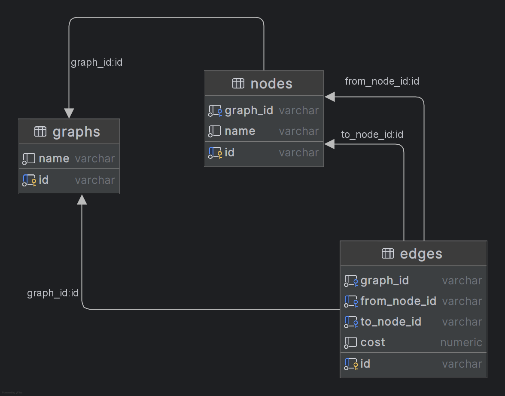

# tucows challlenge

## Project setup

### `poetry`
The project uses `[poetry]`(https://python-poetry.org/) for packaging and dependency management

1. Create Virtual Environment and install dependencies
   ```
   poetry install
   ```
2. Activate Virtual Environment
   ```
   poetry shell
   ```
### `pip` and `venv`   
Alternatively, if you have don't `poetry` installed or don't want to install it, you can use standard python tools
1. Create Virtual Environment 
   ```bash
   python -m venv venv
   ```          
2. Install dependencies
   ```bash
   source venv/bin/activate
   ```          
3. Activate
   ```bash
   pip install -r requirements.txt
   ```          
## Running dependencies
The developed command line programs require some architectonic dependencies. They are made available through `docker` for a seamless experience
```bash
   docker compose up
```
The compose file provides the following services:
### Database
A PostgreSQL server with a pre-created database named `tucows`. This database is by default used by the cli programs.  
### `nginx`
A running instance of a nginx server is provided. This server is configured so the `data` subfolder is offered as static files. This server makes easier to test the graph-loading program.
## Usage
### Schema creation
Before running any code that reference database objects, the data schema must be created. A script for that is provided:
```bash
python -m tucows.run.schema
```
Be careful though, this script deletes all stored data
### Graph loading
As described by the exercise, the code must provide a program for graph loading into a database. You can use one of the provided sample files for convenience 
```bash
python -m tucows.run.graph 'http://localhost:8282/sample-graph.xml'
```
### Graph querying
The other program is a program that should make queries feed by *standard input*, and output the result in *standard output*. Again, a query file is provided for convenience
```bash
cat data/sample-queries.json | python -m tucows.run.query
```
## Design and implementation decisions

### Programming language

The code is written in python

### XML libraries

I decided to use two XML parsing libraries: `xsdata` and `lxml`. `lxml` is a low level parsing library. 
It allows for streaming parsing, which comes in handy when ingesting graphs, as it allows for very big graphs to be processed, even bigger than the available memory would allow. The restrictions over the XML files posed by the exercise allow for this.  

`xsdata` is a high level parsing library (which used `lxml` under the hood) that parses directly to `python` classes. It is used only for convenience in non performance-critical portions. 
   
### JSON libraries

It was not clear to me the there was any special requirement for JSON parsing, given that it is only used to represent queries. Thats why I decided to go with the standard library `json` implementation, with a small library for parsing directly into dataclasses

### SQL libraries

The SQL library chosen was SqlAlchemy. It had all the requirements that the solution for path finding I wanted to implement had (more on this later). And, to be honest, I never used it before, so the decision was partly influenced by my desire to learn it.

### SQL schema



The SQL schema consist of the following 3 tables:

* `graphs`
   * `id`: primary key, defined by XML input
   * `name`: for description purposes, defined by XML input
* `nodes`
   * `id`: primary key, defined by XML input
   * `name`: for description purposes, defined by XML input
   * `graph_id`: which graph this node belongs to?
* `edges`
   * `id`: primary key, defined by XML input
   * `from_node_id`: source node for the edge, defined by XML input
   * `to_node_id`: source node for the edge, defined by XML input
   * `cost`: edge cost, defined by XML input
   * `graph_id`: which graph this edge belongs to?

### Graph Traversal Implementation

The general gist of the solution is having a working set of intermediate paths and iteratively extend them by their endings by following a matching edge. This works both for all paths queries and for minimum path queries (with some small caveats) 

While, traditionally, RDBMS are not optimized for this kind of algorithm, Recursive Common Table Expressions allows for server-side execution of an iterative algorithm, expressed recursively. 


A Recursive CTE consists of two parts, an initial non-recursive term, and a recursive term which can contain references to itself.
The initial term consist of all the source endpoints for the paths we have to find. This is the initial working set. 

On the other hand, the recursive term expands the working set by joining it with all the edges available from the current working set. 
In every expansion, the path between endpoints is accumulated in an array column.

#### Cycle

Because the intermediate paths accumulate all the steps for the path as a part of normal processing, checking if extending it would result in a cycle is just a matter of making sure the next step is not already int the array column   